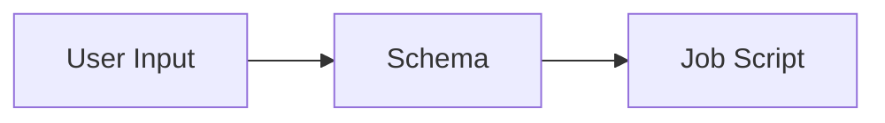

# Drona Workflow Engine Documentation

This documentation site is built with [Docusaurus 3](https://docusaurus.io/) and covers usage guides, architecture, frontend components, and environment development for the Drona Workflow Engine.

## Prerequisites

- **Node.js** >= 18
- **npm** (comes with Node.js)

## Quick Start

You can run the docs dev server two ways:

### From the project root (recommended)

The root `package.json` provides convenience scripts that handle the `cd` for you:

```bash
npm install              # install root deps (only needed once)
cd website && npm install && cd ..  # install website deps (only needed once)
npm run docs:docusaurus  # start dev server on 0.0.0.0:3000
```


### From the website directory

```bash
cd website
npm install
npm start                # starts dev server on localhost:3000
```

Both methods launch a hot-reloading dev server at `http://localhost:3000/dor-hprc-drona-composer/`. Edits to docs and components are reflected immediately without restarting.

## Root-Level npm Scripts (Documentation)

These scripts are defined in the **project root** `package.json` and operate on the Docusaurus site:

| Script | Command | Description |
|---|---|---|
| `docs:docusaurus` | `cd website && npm start -- --host 0.0.0.0` | Start dev server, accessible from any host |
| `docs:docusaurus:build` | `cd website && npm run build` | Production build of the docs site |
| `docs` | `npx documentation build src/** -f html -o docs` | Generate JSDoc API docs (HTML) |
| `docs:markdown` | `npx documentation build src/** -f md > API.md` | Generate JSDoc API docs (Markdown) |
| `docs:serve` | `npx documentation serve src/**` | Serve JSDoc API docs locally |

## Project Structure

Current, we can pivot to other.

```
website/
├── docs/                        # All documentation pages (Markdown / MDX)
│   ├── user-guide/              #   Using Drona, primers & videos
│   ├── overview/                #   Introduction, architecture, getting started
│   ├── frontend/                #   Frontend components & form elements
│   ├── environments/            #   Environment development (schema, map, etc.)
│   └── ...
├── src/
│   ├── components/              # Custom React components (demos, schema rendering)
│   ├── css/custom.css           # Global CSS overrides
│   └── pages/                   # Standalone pages (homepage, etc.)
├── static/
│   └── img/                     # Images and static assets
│       └── user-guide/          #   Screenshots for the user guide
├── sidebars.js                  # Sidebar navigation tree
├── docusaurus.config.js         # Site configuration (navbar, footer, themes)
└── package.json                 # Website-specific dependencies and scripts
```

## Writing & Editing Documentation

### Adding a new page

1. Create a Markdown file in the appropriate `docs/` subdirectory:

   ```bash
   docs/environments/my-new-page.md
   ```

2. Add frontmatter at the top of the file. `sidebar_position` controls the order within its category:

   ```markdown
   ---
   sidebar_position: 5
   ---

   # My New Page

   Page content goes here.
   ```

3. Register the page in `sidebars.js` under the correct category:

   ```js
   {
     type: 'category',
     label: 'Environment Development',
     items: [
       'environments/overview',
       'environments/my-new-page',   // <-- add here
     ],
   },
   ```

### Adding a new sidebar category

Add a new object to the `tutorialSidebar` array in `sidebars.js`:

```js
{
  type: 'category',
  label: 'My New Section',
  items: [
    'my-section/page-one',
    'my-section/page-two',
  ],
},
```

Then create the corresponding directory and files under `docs/`.

### Adding images

1. Place images in `static/img/` (or a subdirectory like `static/img/user-guide/`).
2. Reference them in Markdown with an absolute path from the static root:

   ```markdown
   
   ```

### Embedding YouTube videos

Use a raw HTML iframe in your Markdown:

```html
<iframe
  width="100%"
  height="450"
  src="https://www.youtube.com/embed/VIDEO_ID_HERE"
  title="Video Title"
  frameborder="0"
  allow="accelerometer; autoplay; clipboard-write; encrypted-media; gyroscope; picture-in-picture"
  allowfullscreen
></iframe>
```

### Using Mermaid diagrams

The site has `@docusaurus/theme-mermaid` enabled. Use fenced code blocks with the `mermaid` language:

````markdown

````

### Using admonitions

Docusaurus supports callout boxes:

```markdown
:::note
This is a note.
:::

:::tip
Helpful tip here.
:::

:::warning
Watch out for this.
:::
```

## Developing on the Cluster

If you are editing documentation on an HPRC cluster node (e.g. via the portal shell or an SSH session), the dev server won't be reachable at `localhost` on your local machine. Use **SSH port forwarding** to access it.

### Step 1: Start the dev server on the cluster

```bash
# From the project root — binds to 0.0.0.0 so it accepts forwarded connections
npm run docs:docusaurus
```

The server will start on port 3000 (or the next available port). Note the port printed in the terminal.

### Step 2: Open an SSH tunnel from your local machine

In a **separate terminal on your local machine**, set up port forwarding:

```bash
ssh -L 3000:localhost:3000 <your-username>@<portal-node>.hprc.tamu.edu
```

Replace:
- `<your-username>` — your HPRC NetID
- `<login-node>` — the cluster portal host (e.g. `portal-grace`, `portal-faster`, `portal-aces?`)

For example:

```bash
ssh -L 3000:localhost:3000 a11155@portal-grace.hprc.tamu.edu
```

### Step 3: View in your browser

Open `http://localhost:3000/dor-hprc-drona-composer/` in your local browser. Hot-reload works through the tunnel — edits on the cluster are reflected immediately.

### Tips

- If port 3000 is taken, Docusaurus will suggest another port. Match the `-L` source and desti?nation ports accordingly (e.g. `-L 3001:localhost:3001`). Rarely, your local machine port will be occupied by something else, and can lead to long debugging sessions, so if it does not work, try setting your port to something else, (-L 9999:localhost:3000), this way access the website via `http://localhost:9999/dor-hprc-drona-composer/`

## Building for Production

From the `website/` directory:

```bash
npm run build
```

Or from the project root:

```bash
npm run docs:docusaurus:build
```

This generates static HTML/CSS/JS into the `website/build/` directory. To preview the production build locally:

```bash
cd website
npm run serve
```

### Clearing the cache

If you see stale content or build errors after changing configuration:

```bash
cd website
npm run clear
```

## Deployment

### Automatic (GitHub Actions)

The site is **automatically built and deployed to GitHub Pages** on every push to `master`. This is handled by the workflow in `.github/workflows/docs.yml`.

**What happens on push:**

1. GitHub Actions checks out the repo
2. Installs Node.js 20 and runs `npm ci` in `website/`
3. Builds the Docusaurus site (`npm run build`)
4. Deploys the `website/build/` output to GitHub Pages

The live site is at: **https://tamu-edu.github.io/dor-hprc-drona-composer/**

So the typical workflow is: **edit docs, commit, push — the site updates automatically.** No manual deploy step is needed.

### Manual deploy (if needed)

From the `website/` directory:

```bash
GIT_USER=<your-github-username> USE_SSH=true npm run deploy
```

This builds the site and pushes to the configured deployment branch. This is generally not needed since the GitHub Action handles it.

## Key Configuration Files

| File | Purpose |
|---|---|
| `docusaurus.config.js` | Site title, URL, navbar, footer, themes, plugins |
| `sidebars.js` | Sidebar navigation structure and page ordering |
| `src/css/custom.css` | Global style overrides (colors, fonts, spacing) |
| `website/package.json` | Website-specific dependencies and scripts |
| `package.json` (root) | Project-wide scripts including `docs:docusaurus` |
| `.github/workflows/docs.yml` | GitHub Actions workflow for auto-deploy |

## Troubleshooting

**Broken links warning during build** — The site is configured with `onBrokenLinks: 'warn'`. Fix any reported broken links before deploying.

**Port already in use** — If port 3000 is taken, Docusaurus will prompt to use another port, or you can specify one:

```bash
npm start -- --port 3001
```

**Styles not updating** — Run `npm run clear` then `npm start` to reset the Docusaurus cache.

**GitHub Pages not updating after push** — Check the Actions tab on the GitHub repo to see if the `docs.yml` workflow ran successfully. Build errors (e.g. broken imports) will cause the deploy to fail.

