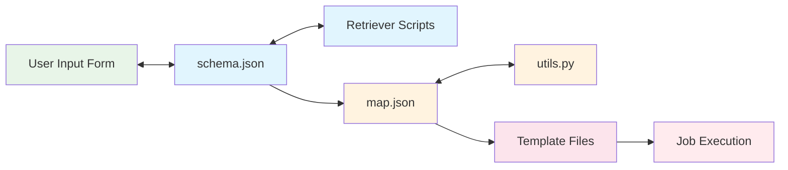

# Workflow Development Overview

Drona Composer workflows are self-contained workflow definitions that transform user input forms into executable computational jobs. Each Drona Workflow defines the complete user experience, from form interface to job execution, enabling specialized workflows for different research domains and computational frameworks.

<!-- TODO: Potential image here -->
<!--  -->

## What are Drona Workflows?

A Drona Workflow is a collection of configuration files, scripts, and templates that define user interfaces through JSON schemas, process form data into executable job scripts, manage dynamic content through retriever scripts, and execute workflows on HPC systems via batch schedulers. Each Drona Workflow represents a complete workflow system tailored to specific research needs, computational frameworks, or hardware platforms.

## Workflow Architecture

Every Drona Workflow consists of core files that work together to define the complete workflow experience:

- **Schema Definition (`schema.json`)** - Defines the user interface and form structure, specifies validation rules and field relationships, controls conditional field visibility, and integrates dynamic content sources
- **Execution Driver (`driver.sh`)** - Template script for job execution that processes form variables into commands while managing execution setup and multi-platform execution
- **Variable Mapping (`map.json`)** - Maps form fields to job variables, defines resource allocation logic, specifies file handling rules, and controls job scheduler parameters  
- **Utility Functions (`utils.py`)** - Provides workflow-specific logic, handles complex data processing, implements custom validation, and manages API integrations

Supporting infrastructure includes retriever scripts for dynamic content and API integration, and modular schema components for reusability across workflows.

## Workflow Sources

We provide publicly available Drona Workflows in our GitHub repository where anyone can contribute new workflows or improvements to existing ones. See the [Publishing Workflows](./publishing) section for guidelines on contributing workflows to the community repository.

Locally created workflows are stored as user workflows in your personal workspace, allowing for custom workflows and experimental development without affecting system-wide workflows.

---

**Texas A&M University High Performance Research Computing**