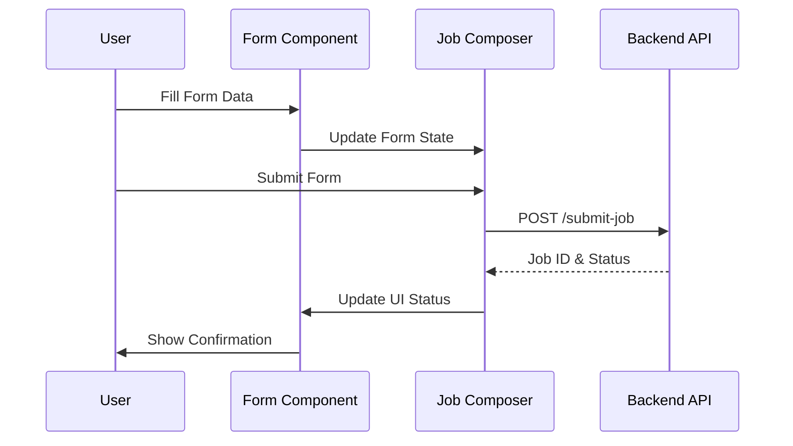
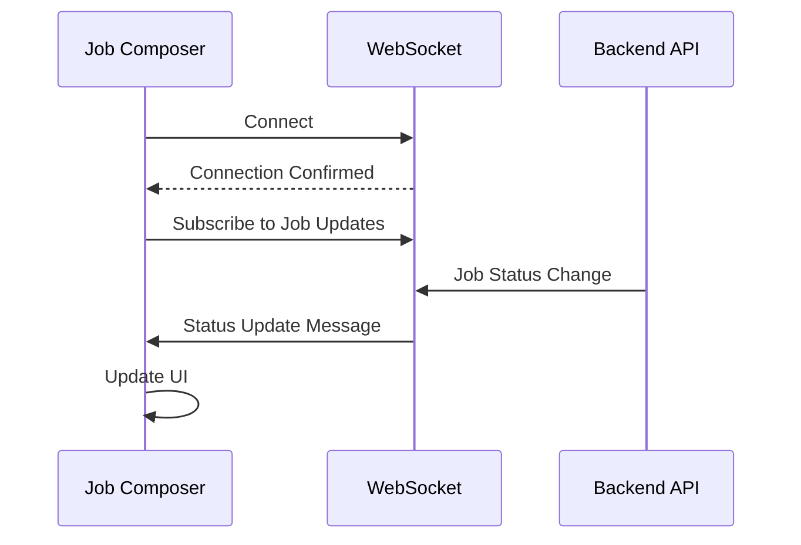

# Frontend Overview

The Drona Composer frontend is a modern React application that provides an intuitive interface for creating and managing HPC workflows.

## Architecture

### Technology Stack

- **React 18** - Modern React with hooks and concurrent features
- **WebSocket Client** - Real-time bidirectional communication
- **React Select** - Enhanced dropdown and selection components
- **Styled Components** - CSS-in-JS styling solution
- **Webpack** - Module bundling and asset optimization

### Component Structure

```
src/
├── components/           # Reusable UI components
│   ├── forms/           # Form input components
│   ├── modals/          # Modal components
│   ├── layout/          # Layout components
│   └── common/          # Common UI elements
├── hooks/               # Custom React hooks
│   ├── usePaneManagement.js
│   ├── useJobSocket.js
│   └── useResizeHandle.js
├── context/             # React context providers
│   ├── GlobalFilesContext.js
│   └── [other contexts]
├── utils/               # Utility functions
├── styles/              # CSS and styling
└── index.js            # Application entry point
```

## Core Components

### Job Composer

The main interface component that orchestrates the entire workflow creation process.

**Location**: `src/JobComposer.js`

**Key Features**:
- Dynamic form rendering from JSON schemas
- Real-time job status updates
- File upload and management
- Multi-pane interface with resizable panels

**Usage**:
```jsx
import JobComposer from './JobComposer';

function App() {
  return (
    <div className="app">
      <JobComposer />
    </div>
  );
}
```

### Form Components

Dynamic form components that render based on schema definitions.

**Available Types**:
- `Text` - Single-line text input
- `TextArea` - Multi-line text input
- `Select` - Dropdown selection
- `Checkbox` - Boolean toggle
- `Number` - Numeric input with validation
- `Time` - Time duration picker
- `Unit` - Value with unit selection
- `Picker` - File/directory browser
- `Module` - HPC module selector
- `Uploader` - File upload component

### Modal System

#### SplitScreenModal

Provides a split-screen interface for comparing configurations or viewing multiple panels.

**Location**: `src/SplitScreenModal.js`

**Features**:
- Resizable panes
- Independent content areas
- Responsive design
- Keyboard shortcuts

#### PreviewModal

Displays job script previews and configuration summaries.

**Location**: `src/PreviewModal.js`

**Features**:
- Syntax highlighting
- Real-time updates
- Export functionality
- Print support

## State Management

### Global Context

The application uses React Context for global state management.

#### GlobalFilesContext

Manages file operations and state across the application.

**Location**: `src/GlobalFilesContext.js`

**Provides**:
```jsx
{
  files: [], // Current files
  uploadFile: (file) => {}, // Upload function
  deleteFile: (id) => {}, // Delete function
  currentDirectory: "", // Current directory path
  setCurrentDirectory: (path) => {} // Directory navigation
}
```

**Usage**:
```jsx
import { useContext } from 'react';
import { GlobalFilesContext } from './GlobalFilesContext';

function MyComponent() {
  const { files, uploadFile } = useContext(GlobalFilesContext);

  return (
    <div>
      {files.map(file => (
        <div key={file.id}>{file.name}</div>
      ))}
    </div>
  );
}
```

## Custom Hooks

### usePaneManagement

Manages the multi-pane interface layout and interactions.

**Location**: `src/hooks/usePaneManagement.js`

**Returns**:
```javascript
{
  panes: [], // Current pane configuration
  activePane: "", // Currently active pane
  resizePane: (paneId, size) => {}, // Resize function
  closePane: (paneId) => {}, // Close pane function
  addPane: (config) => {} // Add new pane function
}
```

### useJobSocket

Handles WebSocket connections for real-time job updates.

**Location**: `src/hooks/useJobSocket.js`

**Returns**:
```javascript
{
  socket: WebSocket, // Socket instance
  jobStatus: {}, // Current job statuses
  connect: () => {}, // Connection function
  disconnect: () => {}, // Disconnection function
  subscribe: (jobId) => {}, // Subscribe to job updates
  unsubscribe: (jobId) => {} // Unsubscribe from job updates
}
```

### useResizeHandle

Provides resizable panel functionality.

**Location**: `src/hooks/useResizeHandle.js`

**Returns**:
```javascript
{
  isResizing: boolean, // Resize state
  startResize: (event) => {}, // Start resize function
  stopResize: () => {}, // Stop resize function
  handleMouseMove: (event) => {} // Mouse move handler
}
```

## Data Flow

### Form Submission Flow



### Real-time Updates



## Styling and Themes

### CSS Architecture

The application uses a modular CSS approach with:

- **Component-scoped styles** for isolated styling
- **Global variables** for consistent theming
- **Responsive design** for mobile and desktop
- **Dark/light mode** support

### Theme Variables

```css
:root {
  /* Colors */
  --primary-color: #007bff;
  --secondary-color: #6c757d;
  --success-color: #28a745;
  --danger-color: #dc3545;
  --warning-color: #ffc107;

  /* Spacing */
  --spacing-sm: 0.5rem;
  --spacing-md: 1rem;
  --spacing-lg: 1.5rem;
  --spacing-xl: 3rem;

  /* Typography */
  --font-size-sm: 0.875rem;
  --font-size-base: 1rem;
  --font-size-lg: 1.25rem;
  --font-size-xl: 1.5rem;
}
```

## Performance Optimization

### Code Splitting

Components are loaded dynamically to reduce initial bundle size:

```jsx
import { lazy, Suspense } from 'react';

const PreviewModal = lazy(() => import('./PreviewModal'));

function App() {
  return (
    <Suspense fallback={<div>Loading...</div>}>
      <PreviewModal />
    </Suspense>
  );
}
```

### Memoization

Expensive computations are memoized for performance:

```jsx
import { useMemo } from 'react';

function FormRenderer({ schema, data }) {
  const processedSchema = useMemo(() => {
    return processSchema(schema, data);
  }, [schema, data]);

  return <Form schema={processedSchema} />;
}
```

### Virtual Scrolling

Large lists use virtual scrolling for performance:

```jsx
import { FixedSizeList as List } from 'react-window';

function FileList({ files }) {
  const Row = ({ index, style }) => (
    <div style={style}>
      {files[index].name}
    </div>
  );

  return (
    <List
      height={600}
      itemCount={files.length}
      itemSize={35}
    >
      {Row}
    </List>
  );
}
```

## Development Guidelines

### Component Creation

1. **Use functional components** with hooks
2. **Implement TypeScript interfaces** for props
3. **Include error boundaries** for robustness
4. **Add unit tests** for component logic

### State Management Best Practices

1. **Use local state** for component-specific data
2. **Use context** for shared global state
3. **Implement custom hooks** for reusable logic
4. **Avoid prop drilling** through component hierarchies

### Performance Best Practices

1. **Memoize expensive calculations** with `useMemo`
2. **Optimize re-renders** with `React.memo`
3. **Use callback optimization** with `useCallback`
4. **Implement virtualization** for large datasets

## Testing Strategy

### Unit Testing

```jsx
import { render, screen, fireEvent } from '@testing-library/react';
import { JobComposer } from './JobComposer';

test('renders job composer interface', () => {
  render(<JobComposer />);
  expect(screen.getByText('Create New Job')).toBeInTheDocument();
});

test('handles form submission', () => {
  const onSubmit = jest.fn();
  render(<JobComposer onSubmit={onSubmit} />);

  fireEvent.click(screen.getByText('Submit'));
  expect(onSubmit).toHaveBeenCalled();
});
```

### Integration Testing

```jsx
import { render, screen, waitFor } from '@testing-library/react';
import { rest } from 'msw';
import { setupServer } from 'msw/node';
import App from './App';

const server = setupServer(
  rest.get('/api/schemas', (req, res, ctx) => {
    return res(ctx.json({ schemas: [] }));
  })
);

beforeAll(() => server.listen());
afterEach(() => server.resetHandlers());
afterAll(() => server.close());

test('loads and displays schema data', async () => {
  render(<App />);
  await waitFor(() => {
    expect(screen.getByText('Schema loaded')).toBeInTheDocument();
  });
});
```

## Next Steps

- [Form Components](./form-components) - Detailed component documentation
- [Custom Hooks](./hooks) - Hook implementation guides
- [Modal System](./modals) - Modal component usage
- [Context Providers](./context) - State management patterns