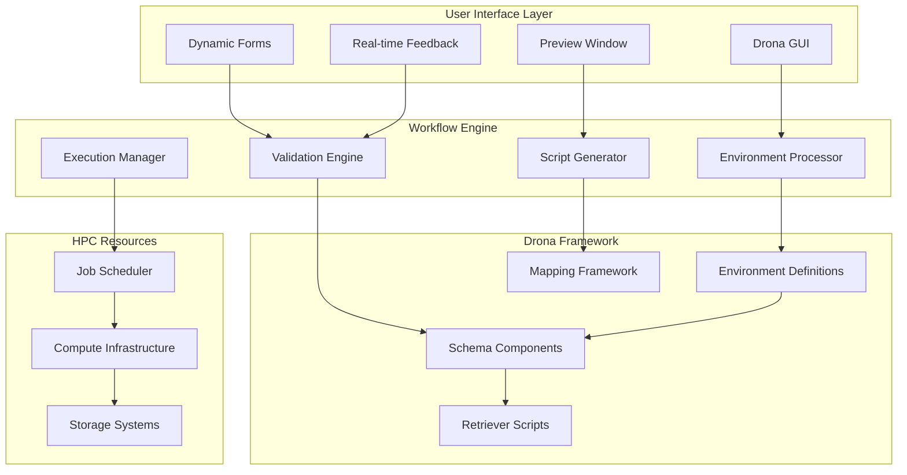
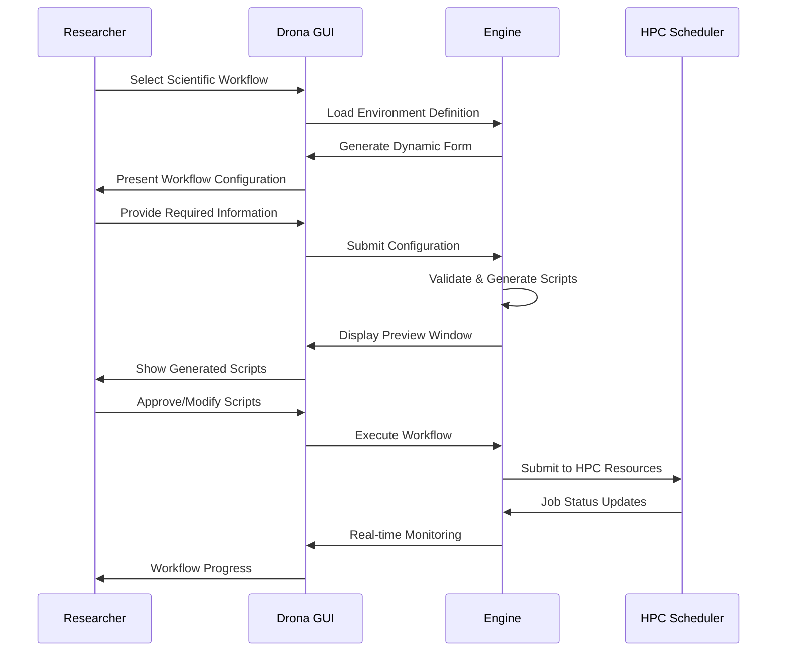

# System Architecture

Drona is designed as a workflow engine that bridges the gap between researchers and HPC resources through an intuitive GUI interface and a flexible framework for scientific workflow management.

## Core Architecture

## Component Overview

### User Interface Layer

**Drona GUI**: Web-based interface that guides researchers through workflow configuration with intuitive form-based input collection.

**Dynamic Forms**: Schema-driven forms automatically generated from environment definitions, eliminating the need for researchers to understand underlying HPC complexities.

**Preview Window**: Fully editable display of generated scripts, providing complete transparency and allowing researchers to make final adjustments before execution.

**Real-time Feedback**: Advanced validation system that provides context-aware feedback with varying severity levels based on researcher input.

### Workflow Engine

**Environment Processor**: Core component that loads and processes Drona environment definitions, managing the workflow specifications and their associated metadata.

**Script Generator**: Advanced mapping framework that transforms researcher-provided information into executable HPC scripts through sophisticated variable processing beyond simple substitution.

**Validation Engine**: Analyzes researcher input for potential issues, providing dynamic feedback to ensure correct and meaningful workflow configuration.

**Execution Manager**: Handles job submission to HPC schedulers and provides real-time status monitoring throughout the workflow lifecycle.

### Drona Framework

**Environment Definitions**: Collections of specification files that define how to generate and execute specific scientific workflows, enabling workflow reuse and sharing.

**Schema Components**: Modular JSON schema elements that define form structure, validation rules, and field behaviors for different workflow types.

**Mapping Framework**: Advanced processing system that goes beyond simple variable substitution to enable complex transformations and conditional logic.

**Retriever Scripts**: Dynamic data collection components that provide context-aware options and real-time information for workflow configuration.

## Workflow Execution Process

### Scientific Workflow Lifecycle

### Design Principles

**Researcher-Centric**: All components prioritize researcher productivity by abstracting HPC complexities while maintaining transparency and control.

**Extensible Framework**: The declarative environment definition system enables easy creation and sharing of new scientific workflows.

**Advanced Processing**: Beyond simple variable substitution, the mapping framework provides sophisticated processing capabilities for complex workflow requirements.

**Full Transparency**: The preview window ensures researchers understand and control what will be executed on HPC resources.

## Implementation Technologies

### Core Technologies
- **Web Interface**: React-based frontend providing the intuitive GUI for workflow configuration
- **Backend Engine**: Python Flask server handling environment processing and script generation  
- **Schema Framework**: JSON schema-based system for dynamic form generation and validation
- **Real-time Communication**: WebSocket integration for live workflow monitoring and feedback

### Environment Framework
- **Declarative Definitions**: JSON-based environment specifications enabling workflow sharing and customization
- **Advanced Mapping**: Sophisticated variable processing system that extends beyond simple template substitution
- **Dynamic Retrieval**: Script-based components for real-time data collection and context-aware configuration options
- **Modular Components**: Reusable schema elements for building complex scientific workflows

## Key Advantages

**Eliminates Learning Curve**: Researchers can run complex HPC workflows without learning scheduler commands, queue systems, or scripting languages.

**Maintains Control**: Full script transparency through editable preview windows ensures researchers retain complete control over their computational processes.

**Reduces Support Burden**: Advanced validation and feedback reduce common configuration errors, decreasing helpdesk tickets and support overhead.

**Enables Collaboration**: Shareable environment definitions allow workflow reuse across research groups and institutions.

**Scales with Complexity**: The framework accommodates everything from simple single-job workflows to complex multi-stage computational pipelines.