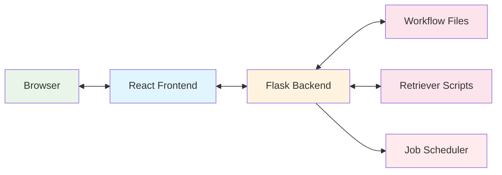
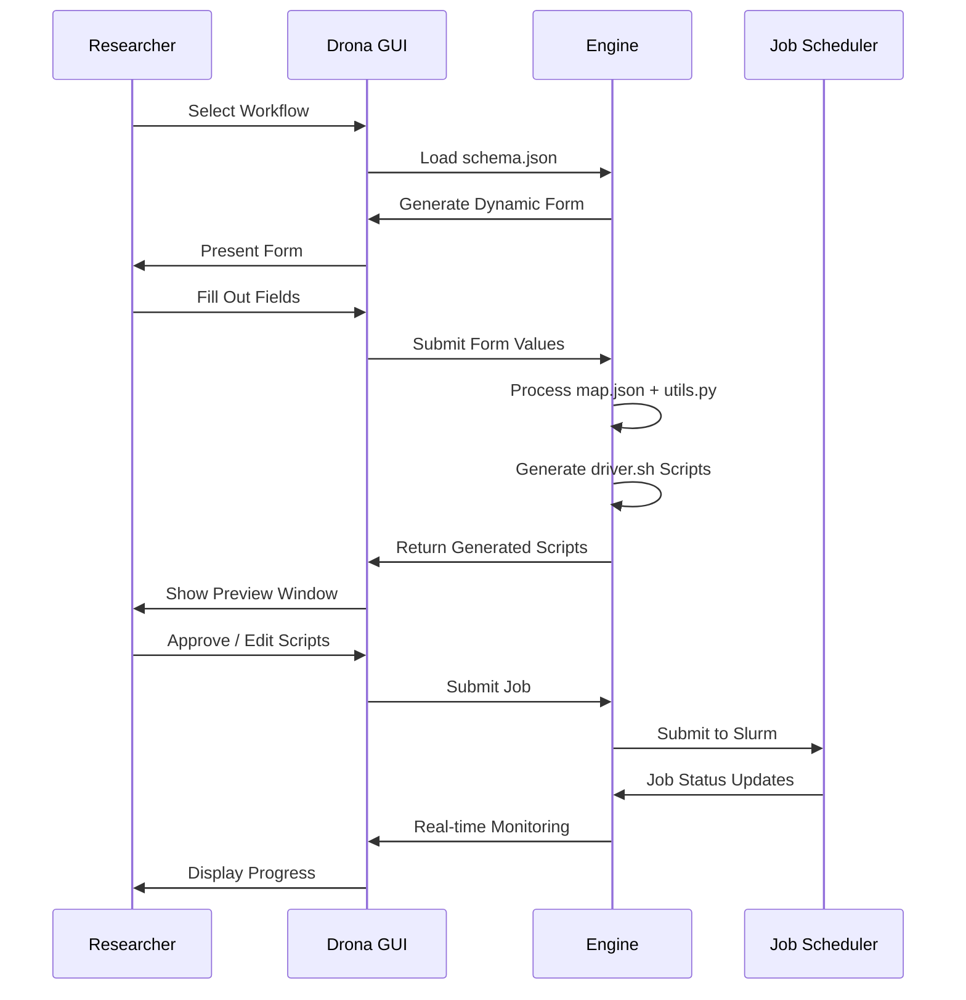

# Architecture

Drona Composer is a React/Flask application that transforms JSON-based workflow definitions into dynamic forms for HPC job submission. This page describes how the major components fit together.

## High-Level Overview



The frontend renders dynamic forms from `schema.json`, the backend processes form submissions through `map.json` and `utils.py`, and the resulting job scripts are submitted to the HPC scheduler.

## Frontend

The frontend is a React application built with Webpack and Babel. Key components:

- **`JobComposer.js`** — Main application component. Manages environment selection, form state, and job submission flow.
- **`schemaRendering/Composer.js`** — Reads `schema.json` and orchestrates form rendering.
- **`schemaRendering/FieldRenderer.js`** — Takes a field definition from the schema and renders the appropriate form component (text, select, checkbox, etc.).
- **`schemaRendering/schemaElements/`** — Individual form components (Text, Select, DynamicSelect, Module, Time, Uploader, etc.). See [Form Components](../frontend/form-components) for the full reference.
- **`PreviewModal.js`** — Displays generated job scripts in an editable preview window before submission.
- **`EnvironmentModal.js`** — Handles environment import from the configured repository.
- **`FormValuesContext.js`** — React context that provides form state to all components, enabling conditional visibility and dynamic field updates.

### Data Flow

1. User selects an environment from the dropdown
2. Frontend fetches the environment's `schema.json` from the backend
3. `Composer` parses the schema and `FieldRenderer` renders each field
4. Dynamic fields (e.g., `dynamicSelect`) call retriever scripts via the backend to populate options
5. On preview, form values are sent to the backend for script generation
6. Generated scripts are displayed in `PreviewModal` for review and editing

## Backend

The backend is a Flask application served through Passenger (in OOD deployments) or directly via `app.py`. Routes are organized into blueprints under `views/`:

- **`job_composer.py`** — Main blueprint. Handles environment listing, form submission, job preview, and job submission.
- **`schema_routes.py`** — Serves schema files and processes `$ref` references for decomposed schemas using `jsonref`.
- **`file_utils.py`** — File operations for uploads, directory browsing, and job file management.
- **`socket_handler.py`** — WebSocket support via Flask-SocketIO for real-time communication.
- **`environments.py`** — Environment discovery and management (system and user environments).
- **`env_repo_manager.py`** — Handles cloning and managing the environment import repository.
- **`history_manager.py`** — Tracks job submission history.
- **`job_routes.py`** — Job status and management endpoints.

### Script Generation

When a user submits a form, the backend:

1. Reads `map.json` to determine how form values map to job variables
2. Performs direct substitutions (`$fieldName`) and calls Python functions (`!function_name($param)`) defined in the environment's `utils.py`
3. Processes the `driver.sh` template with the resolved variables
4. Returns the generated scripts for preview

This processing is handled by `machine_driver_scripts/engine.py` and `machine_driver_scripts/utils.py`.

## Workflow Files

Each workflow environment is a self-contained directory with these core files:

```
MyWorkflow/
├── schema.json       # Form definition
├── map.json          # Variable mapping
├── driver.sh         # Job script template
├── metadata.json     # Name, version, description
├── utils.py          # Custom processing functions
└── retrievers/       # Dynamic data scripts
```

For details on each file, see the [Environment Development](../environments/overview) section.

## Environment Discovery

Drona loads environments from two locations:

1. **`environments/`** in the application directory — system-wide workflows available to all users
2. **`$SCRATCH/drona_composer/environments/`** — per-user workflows

The backend scans both directories on startup and when the environment list is refreshed. System environments appear in black in the dropdown, user environments in blue.

## Workflow Execution Process



## Configuration

Application configuration lives in `config.yml` at the project root, with separate `development` and `production` blocks. The app auto-detects which to use based on whether it's running from an OOD `dev` or `sys` directory. See [Installation](./installation) for configuration details.

## Technology Stack

| Layer | Technology |
|-------|-----------|
| Frontend | React, Webpack, Babel |
| Backend | Python, Flask, Flask-SocketIO |
| Schema Processing | JSON, jsonref |
| Real-time | WebSockets (eventlet) |
| App Server | Phusion Passenger (OOD) or standalone Flask |
| Job Scheduler | Slurm (via shell commands) |

---

**Texas A&M University High Performance Research Computing**
