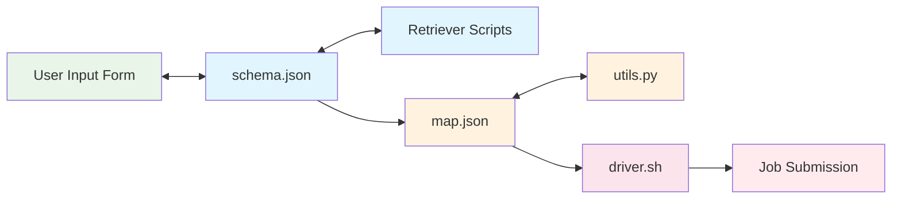

# Introduction

**Drona Workflow Engine** is an HPC workflow assistant and framework developed by [Texas A&M University HPRC](https://hprc.tamu.edu). It provides a 100% graphical interface for creating and submitting computational jobs — researchers provide workflow-specific information through dynamic forms, and Drona generates all necessary scripts, validates the configuration, and submits the job on their behalf.

## The Problem

HPC resources are becoming increasingly complex while simultaneously growing more popular among researchers who may lack traditional HPC skills. Writing Slurm scripts, managing modules, configuring multi-stage pipelines — these tasks create a steep learning curve that leads to frustration, inefficient resource usage, and increased burden on HPC support teams.

## How Drona Solves It

Drona abstracts HPC complexity behind intuitive, workflow-specific forms while keeping the researcher in full control.

### Guided Workflow Configuration

Researchers select a workflow environment and fill out a dynamic form tailored to that specific use case. The form adapts based on user selections — fields appear, hide, and validate in real time. No Slurm syntax or HPC knowledge required.

### Full Transparency

Before submission, Drona displays all generated scripts in a fully editable preview window. Researchers can review exactly what will run, make adjustments, and catch issues before they reach the scheduler. A message pane provides validation warnings and environment-specific guidance.

### Extensible Framework

Drona is not just an assistant — it's a framework. Workflows are defined declaratively through a small set of configuration files:

- **`schema.json`** — Defines the form interface and field behavior
- **`map.json`** — Maps form values to job script variables
- **`driver.sh`** — Template for the generated job script
- **`utils.py`** — Optional custom processing logic

Anyone can create, customize, and share workflows. System administrators deploy workflows for all users, while researchers can develop and test their own in a personal workspace.

### Dynamic Content

Workflows can include retriever scripts that fetch live data — available GPU types, module versions, running job statuses — and populate form fields dynamically. This enables workflows that respond to the current state of the cluster.

### Validation and Feedback

Drona analyzes input values and provides warnings before submission. For example, it might flag that a GPU was requested for longer than the cluster's maximum GPU wall time, or that a required module is not available on the selected cluster.

## Who Is Drona For?

- **Researchers** who want to run scientific workflows on HPC without learning Slurm
- **HPC administrators** who want to provide guided, validated job submission for their users
- **Workflow developers** who want to build shareable, reusable computational environments

## Next Steps

- [Quick Start](../quick-start) — Install Drona and get it running
- [Environment Development](../environments/overview) — Learn how workflows are built
- [Schema Files](../environments/schema) — Understand the form definition system

---

**Texas A&M University High Performance Research Computing**
