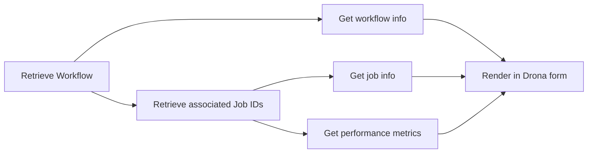

# Monitoring

The Drona Workflow Engine now supports monitoring and managing workflows beyond just creating and launching them. This page covers how to use Drona's **Manage mode** to observe running and completed jobs, interpret real-time metrics, and take action based on insights — all from the same interface used for submission.

:::note
Monitoring features are currently being rolled out. Not all features are available yet. This documentation reflects the intended behavior upon full production release.
:::

## Overview

Previously, Drona focused exclusively on workflow creation and submission. With the addition of Manage mode, Drona bridges a critical gap in the HPC user experience: once a job is submitted, researchers no longer need to switch to separate terminal sessions or external dashboards to understand what their job is actually doing.

Drona's monitoring capabilities provide:

- **Job status and metadata** — job ID, state, elapsed time, and walltime usage
- **Live output logs** — real-time stdout and stderr, streamed directly in the interface
- **Resource utilization** — per-node CPU and memory metrics, Slurm `sstat` statistics, and cgroup data
- **Workflow actions** — cancel a job or request a walltime extension without leaving the interface
- **Domain-specific visualizations** — workflow-aware panels such as protein structure viewers for AlphaFold

---

## Manage Mode

Each Drona environment that supports monitoring exposes a **Manage** tab alongside the standard **Create** tab. Switching to Manage mode repurposes the familiar three-phase Drona interface (Form → Preview → Execution) for observation and control rather than submission:

| Phase | In Create mode | In Manage mode |
|---|---|---|
| **Form** | Collects job parameters from the user | Displays current workflow metadata and offers action selection |
| **Preview** | Generates the batch script | Generates the management command (e.g., `scancel`, walltime extension) |
| **Execution** | Submits the job | Executes the selected action and shows immediate feedback |

To start monitoring a workflow:

1. Open the Drona environment (e.g., Generic, AlphaFold).
2. Click the **Manage** tab.
3. Use the workflow selector dropdown to choose a previously submitted workflow.
4. Drona will load all associated monitoring panels automatically.

---

## Monitoring Panels

### General Info

The **General Info** panel provides a quick overview of the selected workflow's metadata:

- Working directory
- Job name
- Slurm job ID
- Current job state (e.g., `RUNNING`, `PENDING`, `COMPLETED`)
- Elapsed runtime relative to the requested walltime

This panel also includes an **Action** selector where you can choose to:

- **Do Nothing** — view-only mode, no changes made
- **Cancel Job** — generates and executes a `scancel` command
- **Request Walltime Extension** — submits a walltime extension request through the scheduler

Once an action is selected, proceed through the Preview and Execution phases to carry it out. Drona will display immediate feedback confirming the outcome.

### Logs

The **Logs** panel streams the last 20 lines of the job's standard output (`out.<JOBID>`) and standard error (`error.<JOBID>`) files in real time. This allows you to:

- Confirm that your job started correctly
- Track progress without navigating the file system
- Catch errors early without opening a terminal

Logs refresh automatically at a configurable interval and can also be refreshed manually.

### Resource Utilization

The **Resource Utilization** panel is divided into two sections:

#### SSTAT Resource Utilization

This section displays statistics gathered from the Slurm `sstat` command for actively running jobs. Metrics include:

| Metric | Description |
|---|---|
| `MaxRSS` | Peak memory used by any task |
| `AveRSS` | Average memory used across tasks |
| `CPU Time` | Cumulative CPU time consumed |
| `Disk I/O` | Read and write bytes to disk |

These values help you evaluate whether the resources requested in your job script are appropriately sized. If `MaxRSS` is far below your memory request, your allocation may be wastefully large; if it is near the limit, you may be at risk of an out-of-memory failure.

#### Per-Node Utilization

This section shows real-time CPU and memory usage broken down by compute node. Metrics are shown as progress bars per node and are specific to your job's processes — not the node as a whole.

This view is particularly useful for catching **inter-node load imbalance**. A common issue in multi-node jobs is that computation runs only on the primary node due to misconfigured MPI settings, while other allocated nodes sit idle. The per-node view makes this immediately visible.

---

## Post-Completion Monitoring

For completed jobs, Drona surfaces a **Job Efficiency** summary using the `seff` command. This provides:

- CPU efficiency (actual CPU time vs. allocated CPU-time)
- Memory efficiency (peak memory used vs. requested)

These insights make it easy to identify over- or under-provisioned resource requests for future submissions.

---

## Multi-Job Workflows

For workflows that span multiple Slurm jobs (such as AlphaFold, which has a CPU preprocessing stage and a GPU inference stage), Drona tracks each job independently and presents a unified monitoring view. You can:

- See the status of each stage in a single interface
- View stage-specific metrics (e.g., CPU utilization during preprocessing, GPU utilization during inference)
- Act on individual jobs without affecting the rest of the workflow, using the job selection checkboxes

---

## Domain-Specific Monitoring

Beyond generic resource metrics, Drona supports **domain-specific monitoring panels** embedded directly in the workflow interface. These panels allow researchers to evaluate output quality without leaving Drona or launching external software.

### Example: AlphaFold Structure Viewer

The AlphaFold environment includes an integrated 3D protein structure viewer (powered by the [NGL library](https://nglviewer.org/)) alongside per-residue confidence plots (pLDDT scores). Researchers can:

- Inspect the predicted 3D structure, color-coded by confidence level
- Review pLDDT curves across all five ranked models
- Identify low-confidence regions that may warrant resubmission with adjusted parameters
- Switch between top-ranked models using a rank selector

This replaces the need to download output files and open a separate visualization application, keeping the research iteration loop entirely within Drona.

---

## How Monitoring Works Internally

Drona's monitoring relies on its **workflow history database**, which stores metadata that Slurm alone cannot provide such as the Drona environment used, the working directory, and all Slurm job IDs associated with the workflow. This database is populated automatically during job submission via the `drona_wf_driver_sbatch` driver template, which submits batch jobs, captures their IDs, and writes them back to the database record.

When you open Manage mode and select a workflow, Drona follows this pipeline:

For more details on the database schema, querying, or how `drona_wf_driver_sbatch` records job IDs, see the [Workflow History Database](../environments/database) page. For the complete list of the retriever functions that power the job monitoring, refer to [Retriever Scripts](../environments/retriever-scripts) page.

